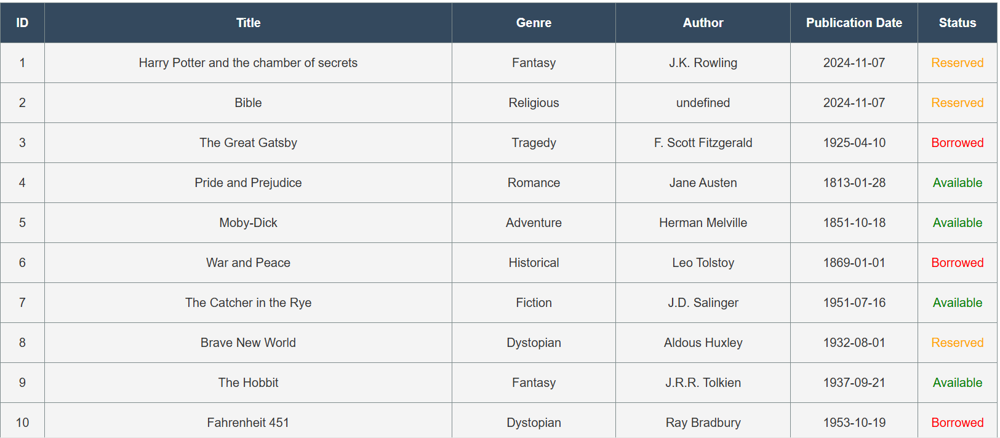

# Library Admin - Dashboard & CRUD Application

## Overview

The **Library Admin** project is a web-based application that allows users to manage a library's book collection through a CRUD (Create, Read, Update, Delete) interface and visualize library data through graphs. The project is built with HTML, CSS, JavaScript, and Node.js.

## Features

1. **CRUD Functionalities**:
   


   - **Create**: Add new books to the library collection.
   - **Read**: View all books in the collection in a structured table.
   - **Update**: Modify the details of an existing book.
   - **Delete**: Remove books from the collection.

3. **Filter and Search**:

   - Filter books by genre using radio buttons.
   - Search books dynamically by title, author, or genre using a search bar.

4. **Data Visualization**:

   - A **Pie Chart** that shows the distribution of book statuses (Available, Reserved, Borrowed).
   - A **Bar Graph** that visualizes the number of books per genre.

5. **Interactive Dashboard**:
   
   - A dedicated dashboard section that displays the graphs.
   - Easy navigation between the main CRUD interface and the dashboard.
     

## Setup and Installation

### Prerequisites

- Node.js installed on your system.
- A modern web browser (e.g., Chrome, Firefox).

### Steps

1. Clone the repository:
   ```bash
   git clone https://github.com/your-username/library-admin.git
   ```
2. Navigate to the project directory:
   ```bash
   cd library-admin
   ```
3. Install dependencies:
   ```bash
   npm install
   ```
4. Start the server:
   ```bash
   node server/app.js
   ```
5. Open your browser and go to `http://localhost:3000`.

## Usage

### Main Interface

- The main interface displays all books in a table format with options to add, update, delete, or filter books.


### CRUD Functionalities

- **Add Book**: Click on the **Add Book** button, fill out the form, and click submit.
- **Update Book**: Click on the **Update Book** button, enter the book ID, and modify the details.
- **Delete Book**: Click on the **Delete Book** button, enter the book ID, and confirm deletion.

### Dashboard

- Navigate to the dashboard by clicking the **Dashboard** link in the navigation bar.
- View the graphs displaying the status distribution and genre statistics of the library's collection.

## File Structure

```
project-root
├── css
│   └── style.css       # Styling for the project
├── html
│   └── index.html      # Main HTML file
├── node_modules        # Dependencies installed via npm
├── script
│   ├── graphs.js       # JavaScript for graph functionality
│   └── script.js       # Main JavaScript functionality
├── server
│   ├── app.js          # Main backend application script
│   └── books.json      # JSON file containing library data
├── package.json        # Project metadata and dependencies
├── package-lock.json   # Dependency tree lockfile
└── README.md           # Project documentation

```

## Technical Details

### Backend

- The server is built using **Node.js** and serves the book data from a `books.json` file.
- RESTful endpoints:
  - `GET /books`: Retrieve all books.
  - `POST /books`: Add a new book.
  - `PUT /books/:id`: Update an existing book.
  - `DELETE /books/:id`: Remove a book.

### Frontend

- Interactive UI built with **HTML**, **CSS**, and **JavaScript**.
- Charts implemented using the **Chart.js** library for data visualization.

## Future Improvements

- User authentication for secure access.
- Pagination for better management of large datasets.
- Export data functionality (e.g., CSV or PDF).
- Enhanced search capabilities (e.g., search by multiple fields).

## License

This project is licensed under the MIT License.

